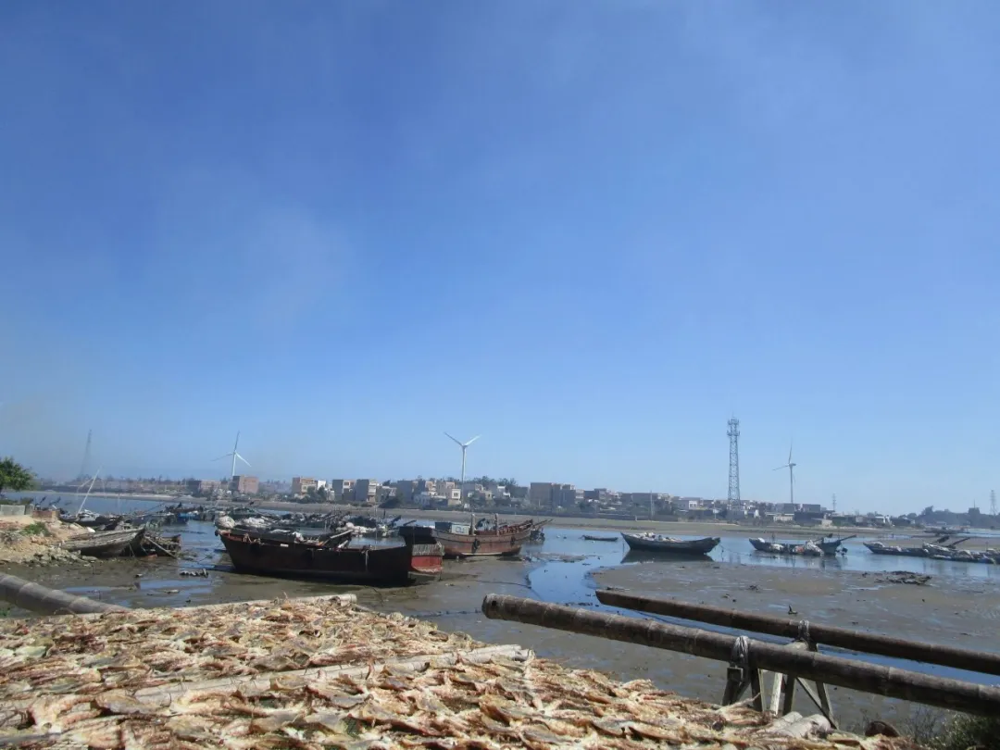
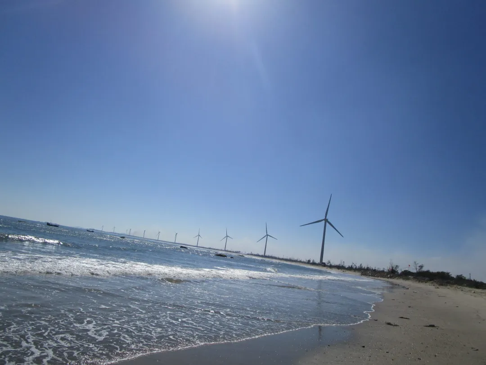
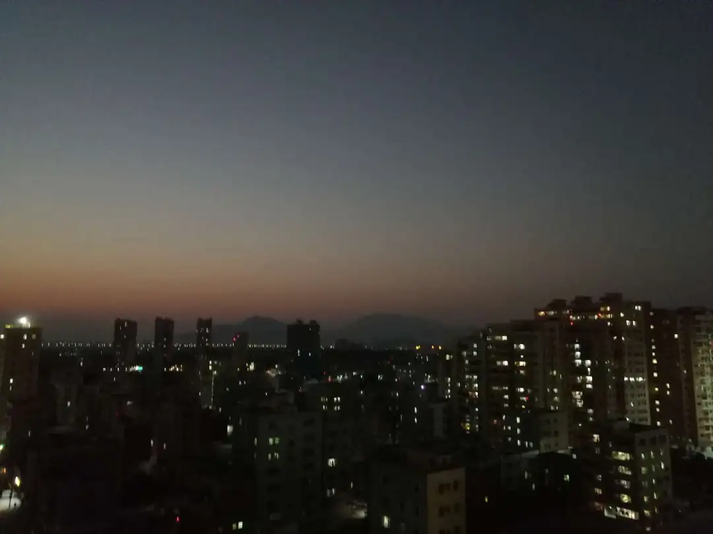
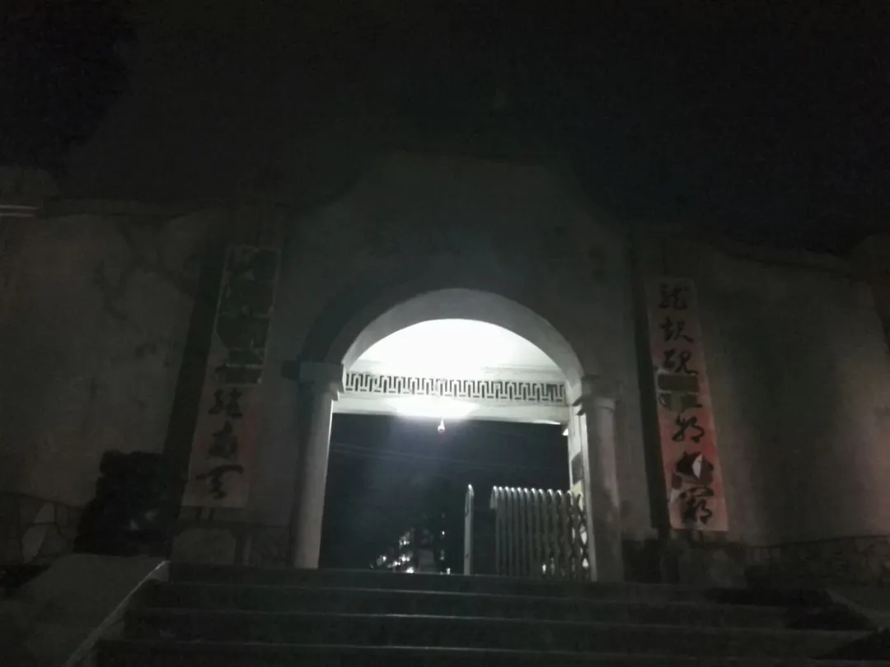

# 前言

我是一个土生土长的陆丰人，我的爸妈也都是如此。我不知道我们祖祖辈辈在这里生活了多久，但是我知道这里永远是我的故乡。

# 家乡中的故乡——湖东

在陆丰中再细分我的故乡，那就是湖东。那是一个我呱呱坠地的地方，一个沿海小镇。湖东这个小镇确实是名副其实的海边小镇，一出门走几步就可以走到港口，港口里停满了木质的老式渔船。走在上面，可以看见渔获归来的渔民在码头上贩卖海货。晴天时走在上面，一排排的木架上面晒满了干货。一边是内港，一边是民房，很有海边小镇的风味。

在我妈那里，经常能听到她怀孕期间在湖东的祖公厝（放祖宗牌位的屋子）里发生的各种事迹。什么闹鬼啊、没人来陪她啊、一推旯牙（一种蜘蛛）、我出月后的台风啊（据说我差点被命名台风)。不过自我出生出月后，我就去到陆丰的市区——东海镇生活。之后在我学步时可能也有回去住过一段时间，其余时间只有清明节和过年时回去了。

对于湖东，我有特别的情感，也不知道怎么解释，就是那种根在那的感觉。毕竟我的父母都是湖东人，我也是在那出生的，每次回去都有一种得到归属的感觉。还记得小时候回去是坐那种绿色的小巴，那时的路况也不好，一堆人挤在里面颠颠簸簸。不过每次回去我都是开心的，每次离开时则有一种不舍感。现在的湖东也一直在发展，从小巴变成大巴再变成电动的公交车还有环绕着小镇的风力发电的风车。湖东也在变成一个现代化的小镇，但是在我心里她永远是那个有海风的味道的海边小镇！

# 我成长的地方——东海

自我出生后我就到东海镇居住，我在这里读幼儿园、学前班、小学、初中和高中。我们在这里租了多次房子，最后也买了房，每个地方我都有不一样的记忆，这里我就不多说了。东海，这是一座繁华的小镇，特别的有烟火气息。

由于我从小在这长大，我的海陆丰话口音是一口东海腔。我从小学开始都是走着去上学的，所以也体会到了各种不一样的烟火气息。小学我在东风小学，附近就是龙山中学（这可能为我高中上龙山打下铺垫），门口就有一条东风美食街。各种烧烤、碗粿、虾粿，甚至一些外来的小吃也是最先出现在东风附近，不过我小时候太穷大多吃不起……学校一出门就是东河——东海的母亲河，端午节时我总是会在河边看龙舟，这些都是美好的记忆。初中在龙潭中学，去上学时经过玉照公园，早上去上学的我总能看见晨练的老人，那种感觉十分有朝气。高中时在龙山中学，那是一所具有近三百年历史的高中，甚至我的爷爷也是毕业于此，在那里我受到了文化的熏陶，各种红色故事就曾发生在校园里（这可能培养了我的爱国精神），四处都是文化的沉淀，记忆最深刻的是我晚修回家时，走在龙山脚下寂静无人的无光的巷子里，抬头看天上的星星，在紧张的晚修后 （我怎么好意思说得出口-_-||——2022年12月28日） 算得上是一种放松。

其实我读的那所东风小学也是有三百多年历史的，想起小学校歌里的歌词——“漯河波光闪闪”，又想起龙山的校歌歌词——“同学们努力前进，进向那革命的战场”，这一切都在诉说着这座小镇的历史文化，虽然现在并没有有巨大的发展，但是有朝一日她会恢复到与她历史中相符的地位。

# 结语

陆丰还有很多的小镇，碣石、甲子等等，每一座都有他独特的感觉和历史文化，以后我可能会发一下陆丰的山山水水，让你们更好的了解陆丰的美丽风景~