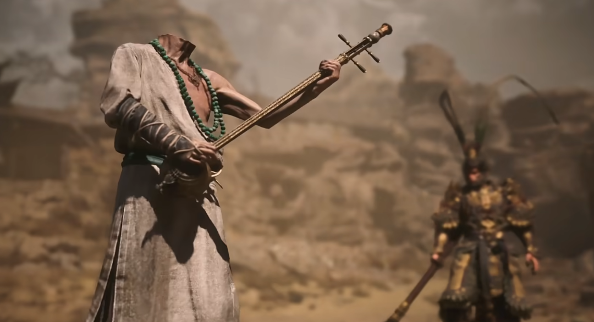

最近玩《黑神话·悟空》真心觉得这游戏做得挺好，我个人可能更看重他的剧情部分，故事讲得真挺好的。这好像从我喜欢的一些游戏也能看出，比如我很喜欢《迷画之塔》三部曲，那故事讲得真的很让人能带入进去。这几天我通关了第一章，然后也打了一部分第二章的内容。第一章结尾的动画短片真的很好看，结合上前面打Boss把动画里的角色都了解（打死~）过一遍了，真的很让人沉浸其中。写下这段文字只是想记录记录我的胡思乱想，这胡思乱想是有个时间线的。

打完第一章后，当我还沉浸在第一章的故事中时，第二章开头的陕北说书又把我给震撼到了。我个人认为这太TM摇滚了吧，这节奏、这Real的语言、这腔调，简直就是中式摇滚。之前听谭维维的《华阴老腔》和看《活着》电影时里的秦腔时我就这样觉得，原来老秦人才是最早的滚人。

回到正题，正是这段陕北说书让我印象深刻，所以今天上班时打开了网易云，打开了黑神话音乐精选，《黄风起兮》就是游戏里听到的陕北说书。在我听了几遍后，看到了第一章结尾动画的BGM《看见》，这首也好听，歌词也很贴近剧情，应该是量身定制的吧。歌词里写到“色与空，弹指间。贪嗔痴，看见。”是阿，就如黑熊精问菩萨：“出家人尘缘已断，金海尽干，长老他为何偏偏放不下一件衣裳？”我觉得是因为金池长老还没有放下色相，在他看到袈裟的一弹指间他就破了色相了。其实从长老和黑熊精利益交换来看，从一开始就有了贪欲吧。所以为什么放不下一件袈裟呢？大概是长老根本没有得道吧。

再次回到正题，正当我想得起劲时，觉得这歌里面的诵经声很好听，所以就搜了经文来听听。听到《金刚般若波罗蜜经》时，觉得很好听阿，所以我就听了几个小时的金刚经。里面有这么几句我觉得挺好，而且又跟前面金池长老的剧情挺贴合的。

> 若菩萨有我相，人相，众生相，寿者相，皆非菩萨。
> 凡以色拜我，以音声求我，是人行邪道，不能见如来。
> 凡所有相皆为虚妄，若见诸相非相，则见如来。
> 一切有为法，如梦幻泡影，如露亦如电，应作如是观。

长老为相所困，因此得不了道。这里就不对经文做什么解释了，因为只有自己去理解才叫经，如果尽信别人的解释那就不是经。不过这最后一句，也太哲学了吧，多少人能做到如此呢。

最近有人说我虚伪，这件事我也思考了挺久。首先，应该没有人不存在虚伪吧，我说过很多次我目前对事物的看法就是没有绝对的东西，所以每个人都应该有虚伪只是程度不同。再者，什么是虚伪？把他拆成两半来看，虚伪是虚假和伪装。我想了很久我们一直以来交流中我有说了很多虚假的话和做了什么伪装的事吗？当然肯定是有的，就如我前面说到的，但是程度大吗？并没有，我自认为我的言行和我所想基本都是一致的。最后，如果要说虚伪的程度，似乎对方更胜一筹，因为每次骂我前一定是夸我，每次说坏话前一定是好话，还有各种矛盾的行为，这是不是更虚伪呢？

胡思乱想写出来就变成了胡言乱语，但是至少把所想记录下来了，有时候做比想更重要！