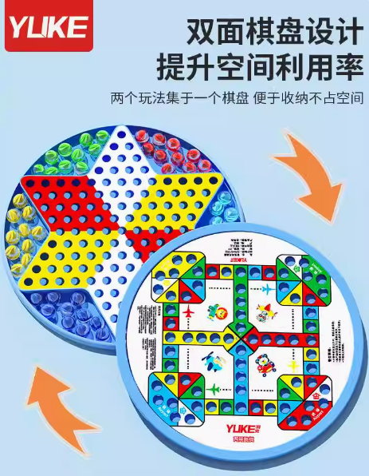

这篇文章发出去的时候就是我的农历生日啦！先祝自己生日快乐，然后趁我有点记忆，回忆一下我对生日这个东西的记忆~

幼年时期的记忆已经越来越模糊了，已经不记得在我很小的时候是怎么过生日的，或许没有什么特别的过过。记忆中最早会在生日那天做的事就是，我妈会在早上煮蛋，吃一颗蛋就算是特别的仪式了。然后我应该会跟我爸妈说我想要什么东西或者要钱吧，已经记不清了。依稀还记得，有一次我跟我爸要跳珠玩具。就是那种一个圆盘上面有很多洞洞组成六角星，然后玩的规则是把玻璃珠放在洞洞上，全部珠子跳到对方的家里就算赢。结果我爸晚上回来忘记买了，我哭得很伤心，不过后面应该还是补买给我了。不知道为什么，对这种别人答应我我等了很久最后没有完成的事情我会非常的伤心，我的记忆中有很多这种瞬间。

大概到接近初中时期，生日那天的仪式就多了一个小蛋糕。可能是家里条件好了一点点，我爸妈会给10块钱去买蛋糕。我就会拿着10块钱跟我二姐去蛋糕店买那种巴掌蛋糕，我还记得一般都是在哪买的，一般是贸易城下面的蛋糕店或者是玉印那的麦香村。我当时应该还是挺期待这个蛋糕的，买到后就会放在冰箱里，等到晚上点根小蜡烛许个愿，然后就开心的吃蛋糕。

大概到了高中时期，好像又回到了吃鸡蛋的阶段。可能是我二姐去外地读书了，也可能是我那时懒得去做这件事了。

大学时期，emmm真的老了，居然也记不太清。应该是分成两种情况吧，因为我的生日在农历七月末，一般就在开学前后。所以要不就算是暑假在家过，要不就是在学校过。在学校的话，基本就是延续我家传统吃个蛋然后这天吃好一点。在家的话，应该又会去买个小蛋糕了，只不过现在可能涨价到20块钱了。为啥又会买小蛋糕了，可能是我二姐回家里工作了吧哈哈。除此以外，我家里人应该开始发红包给我了。

工作后，前两年的生日都是跟我当时的女朋友过的。我还记得第一年的礼物是DIY盲盒，第二年的礼物是精心布置的冰箱，里面有蛋糕和吃的，还有一件T恤。这应该是我最大的生日蛋糕，礼物也是我收过最有心意的礼物了。不管怎么样谢谢当时的她吧，虽然每次那天都会吵架，这里就不说太多了哈哈。

去年，我又开始一个人过生日了。我还记得那天我在公司食堂吃了蛋，在公司面馆吃了面，晚上下班买了个抹茶小蛋糕吃。

突然想起一件趣事，应该是我小学时，有一次我生日前在找家里的一个小游戏机没找到。然后我二姐帮我找到了，在我睡着的时候，她用绳子把游戏机绑起来吊在我床上，就在我眼前吊着。结果我半夜醒来时看见一个黑影在我眼前，吓得我不敢睁眼冷汗直流，最后没办法了鼓起勇气定睛一看，原来是游戏机。可恶，差点在生日那天被吓死阿！

再说一下我对别人生日记忆深刻的瞬间。首先是我大姐，她很早就有大蛋糕吃了，都是别人送的。然后是我小时候的邻居程程，应该是我最早吃过的大蛋糕。还有我妈同事的儿子生日经常会邀请我们，很隆重。还有我和二姐给我妈和奶奶过过几次生日，特别是给奶奶过那几次，是我记忆中不多的后期她开心的瞬间。

对了，我记忆中好像以前有几个女孩子会特别记得我生日，然后踩点祝我生日快乐，谢谢你们，虽然现在都没了，有的可能已经结婚了哈哈。

经常有人说了解这个世界，最近我觉得世界是了解不了的，其实了解的都是你自己，那就最后祝我过完生日可以越来越了解自己吧！