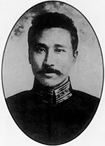
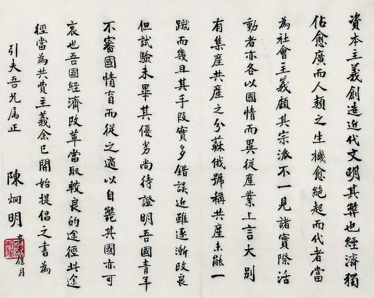

# 前言

有时候回顾历史，对于历史中出现的人物，我们总是以现代的角度去评判他。其实，任何的历史人物和事件都应该站在当时的时代背景和不同的角色角度去看待。曾经听一位历史老师说过：“看待一个人物，可以从当时其他的大人物对他的评价和行动来做参考，可能会更客观”。我觉得很有道理，至少当时的人跟这个人物是同处一个时代。甚至不同的角色如朋友、对手的评价可以做到对这个人物的描绘更加完整。对一个事物的评价，有时候很难脱离立场影响。有段时间我读了一些些儒家的经典，很多人说儒家是“虚伪的道义”甚至于是“统治者的工具”，其实我个人认为这也是脱离时代背景的。跑题了，铺垫了这么久其实这篇文章我就是想介绍一下我家乡一个近代的人物——陈炯明，我个人认为他是一个“好人”。这里为什么好人要用双引号呢？首先我不知道，对“好人”的定义应该是什么，由于政见问题，对于统一派的国共两党来说，这个“背叛”了孙中山的人肯定算不上“好人”，这里我说他是个“好人”只是从我个人对“好人”的感受来说的。

# 介绍

****

陈炯明（1878年1月13日—1933年9月22日），汉族，幼名捷，字赞三，又字月楼、竞存。广东海丰县白町乡人。粤系军事将领，中华民国时期军政代表人物之一。

1887年入县学，后在惠州读书，1898年考中秀才。1905年和1908年先后毕业于海丰师范学堂、广东法政学堂。早期思想激进，敢做敢为。1911年10月武昌起义爆发后，在香港召集同志准备东江起义，被推举为起义军总司令，旋与邓铿赴归善（今惠阳区）组织起义。11月6日，在淡水起义，打响东江起义的第一枪。二次革命中，宣布广东独立，二次革命失败后流亡南洋。1916年在惠州附近成立了广东共和军总司令部，任总司令，参加护国。袁世凯死后，交出兵权，北上晋见段祺瑞、黎元洪，获“定威将军”称号。1917年随孙中山南下护法，率亲军组成援闽粤军。1918年1月，兼任惠潮梅军务督办，率部入闽。1919年10月任国民党广东支部长，反对孙中山北伐，鼓吹联省自治。后因反对北伐，且以辞职相威胁，被免去内政部长、广东省长和粤军总司令职，保留陆军部长。1922年6月指使所部叛变，炮轰孙中山驻地后回任粤军总司令。

1924年1月4日，孙中山通电讨陈。陈炯明通电下野，退居香港，残部退往东江一带，后经广州国民政府两次东征，被彻底消灭。1925年10月10日，美洲致公堂改组为中国致公党，推举陈炯明为总理，唐继尧为副总理。1933年9月22日，病逝于香港。

# 评价

> 《上海新申报》对陈炯明评论：“陈氏为人刚毅果敢沉默寡言，其私人道德，可为南北权要之模范”。
>
> 章太炎也赞誉陈“清操绝于时人，于广中弥不可得”。
>
> 孙中山曾坦言陈炯明“不好女色，不要舒服，吃苦俭朴，我也不如”。

上面是我在网上找了一些名人等第三方对陈炯明的评价，具体出处是否真实这里我没去考证。由于后期“背叛”孙中山，所以后期双方在舆论上互相抹黑是习以为常的事情，以至于我们回看历史会有很多“噪音”。信息传播就是这样，先不管如“胜利者书写历史”这种情况，就算是一篇客观的报道也可能因为转述、叙述而失真。上面几个评价，可以看出陈炯明其人应该是一个私人品德方面非常优秀的人。可能有人会拿他“背叛”孙中山来说事，我个人是觉得这种政见方面的东西需要分出对错是很难说的。有人说他在炮击总统府前有漏风“何时何地进行炮击”，要不然孙中山是跑不掉的。我个人觉得是非常有可能的，从后面他自己的表述来看他也没有想置孙中山于死地的想法。我个人对私人品德方面能坚持恪守的人是非常敬佩的，这可能也是我对他有“好”的评价的重要原因。

在我找到的一些陈炯明管理过的地区对他的一些记录里，有我对他是“好人”的第二个重要原因。如果是上面的第一个原因是因为“德”，这第二个原因就是“仁”。他的施政是偏向改善民生的，尽管我也有看到一些报道说他在惠州海丰期间剥削百姓的报道，但是我不确定那是不是跟我上面说过的一样是失真的“噪音”。我现在就在广州工作，陈炯明留下的遗产“骑楼”、“一德路”等富有远见的建设还在发挥作用，推动教育、禁毒禁赌在现在看来都仍然富有建设性。很多人说这些“仁”是目光短浅的，要成大事就要有所牺牲等等，我个人持中立态度，可能我个人还是更倾向这种小“仁”。

下面是一幅陈炯明的书法，刚好内容是讲共产主义。首先字我个人认为非常好看，再者内容我个人也觉得写得很好。俗话说字如其人，全篇写得工整端正，章也盖得端端正正，可以看出是一个很有原则行事端正的人，当然这只是我的个人的猜测。

> 陈炯明后来避居香港。“九一八”事变后，日本人企图拉他下水，他则反过来要求日人归还东北三省。日人拉拢不成，仍赠他8万元支票，陈炯明在支票上打叉退还。其后，他派代表参与将美洲洪门致公堂改组为中国致公党，与中国共产党合作抗日，直至今日都是参政党之一。

这是流传的陈炯明在抗战期间的故事，有趣的是致公党确实是现在中国最大民主党派之一。日本收买一事广为传播不知真假，还有其中与共产党合作抗日一句也同样不知真假，因为在百度百科里提到到了：1931年“九一八”事变后，他发表《敬告国人书》，说：“目前心腹大患，尤非较轻于日寇，共产党遍布南方各省，随时皆可乘机爆发。”他还向国民党建议“宁(南京政府)任外交，收复失地，粤任剿共，巩固后方”，和当时蒋介石的“攘外必先安内”互相呼应，这似乎有点矛盾。我不是学者不可能全部去查证，从我个人感觉来说，我觉得拒绝日本人大概率是真的。做过同样的事的还有另一个有名的“军阀”——吴佩孚，此人我也是非常敬佩的，这里军阀的引号我解释我个人理解，本身军阀的定义就宽泛，如果军阀统一了中国或者军阀加入胜利者的军队成为将军那么就好像又不算军阀了。在我们的潜意识中军阀这个词汇好像就是一个贬义词，实际上我个人认为只是一种状态，就比如在某些时刻孙中山、蒋介石看起来不也是一个“军阀”？又跑题了，总而言之这里是我认为陈炯明是“好人”的又一点，就是“爱国爱家”。

# 结语

最近看朴树的采访，他说他不相信语言更相信音乐的表达。我觉得很有道理，语言、文字终究只是一种把你的想法表达出来的工具，既然是工具就不可能作出完美的诠释。以上的想法更多是我带入我自己，去尝试理解陈炯明而写出的，终究也只能是我个人想法。世界万物是非对错很难说清，世界本身就是一个混沌的状态，取决于你怎么去看而已。五条人有一首《陈先生》，短短三句话用三种语言概括了陈炯明的一生，旋律也很好听，推荐大家听一下。

# 参考资料

[陈炯明 - 百度百科](https://baike.baidu.com/item/%E9%99%88%E7%82%AF%E6%98%8E/645847) 

[陈炯明在漳州 - 漳州人民政府](https://www.zhangzhou.gov.cn/cms/siteresource/article.shtml?id=520327713210920000&siteId=620416811908440000)

[民国军事家陈炯明私德为孙中山赞誉，书法当代罕见 - 搜狐网](https://m.sohu.com/a/125372553_424918?_trans_=010004_pcwzy)