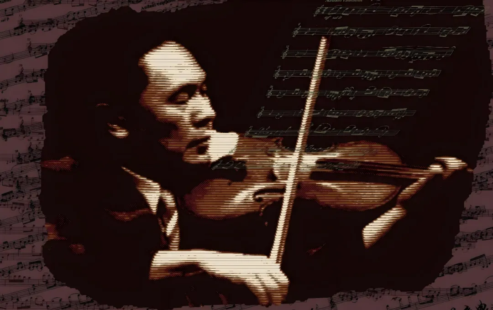

# 前言

一直都知道家乡有个音乐家，做过中央音乐学院的首任院长名字叫马思聪。但是之前一直停留在知道有这么个人的程度。直到某个秋天的下午，我心血来潮的想听听这位家乡著名音乐家的曲子。在公司打着代码的我，打开网易云搜索马思聪，播放最热门的《思乡曲》。很难解释当时这个小提琴曲带给我多大的震撼。在我听到音乐的瞬间，我马上想起我在陆丰电视台看过的一个视频，标题大概是“陆丰风光”，他的背景音乐就是用的这首《思乡曲》。我不知道我是因为想起我童年孤独的对着这个十几分钟的纯风光片看重复看几十分钟的悲伤，还是因为觉得把一首名字叫做思乡曲的曲子配在一个在家乡的风光片这件事太浪漫了，还是因为我身在异乡被这首曲子传达的感情感动了，反正我确确实实被震撼到了。那天过后，我就想着一定要为马院长写篇文章。

# 简介

我要把每一个音符献给祖国。——马思聪

1912年5月7日，马思聪作为马家的第五个儿子，出生在广东省海丰县幼石街上的一座深宅大院里，小名艾。马思聪的父亲马育航同广东的风云人物陈炯明是总角之交，后来当上了广东省的财政厅长，这才得以维持9个儿女的一大家的生活。马思聪的父母都不懂音乐，但广东的戏剧之乡海陆丰所独有的地方戏剧音乐深深地影响着童年的马思聪。

1923年，11岁的马思聪终于实现了他的梦想，随大哥来到法国，开始了他的音乐生涯。先后就学于南锡音乐学院、巴黎音乐学院学习小提琴 。

1929年初，马思聪因家境突变回国。在香港、广州、上海等地演出，被誉为“音乐神童”。

后1930年再次赴法，向毕能蓬（Binembaum）学作曲。

1931年，广东省政府官费资助，马思聪再次赴法留学，第二年归国，任中国第一所现代“私立音乐学院”院长，主要在广州、香港、上海、南京、北平等地从事演出。同时，又先后在广州音乐院、中央大学教育学院音乐系任教。

1932年马思聪与他的女弟子王慕理结婚。

1937年抗日战争爆发后，多年转辗于华南、西南各地坚持从事频繁的演出，并先后任中山大学教授、中华交响乐团指挥、贵阳艺术馆馆长等职。

1945年抗战胜利后，先后担任台湾交响乐团指挥、广州艺术音乐系主任、上海中华音乐学校校长、香港中华音乐院院长等。

1950年后任中央音乐学院首任院长，并兼任中国音乐家协会副主席，《音乐创作》主编等职。

由于文革原因，1967年1月经香港出走，赴美国定居，从事作曲、教学工作。

1971年7月，美国总统安全事务助理基辛格从北京返回美国，周恩来托其向马思聪转达：“我平生有两件事深感遗憾，其中之一就是马思聪50多岁离乡背井去美国，我很难过。”

1987年5月20日于美国费城逝世。

2007年12月14日，马思聪异国辞世20年后骨灰归葬中国广州，同日《马思聪全集》在广州艺博院举行首发式。[1]

# 评价

对于马院长，最有争议的点在于文革这段”叛国投敌“的经历，还有后续马院长和台湾密切的联系上。先表达一下我对文革的看法，我个人其实是非常理解文革的精神的。但是这件事得分为理想和现实，其实我一直有表达过我对事物的看法，就是任何事物没有绝对。无产阶级里也有坏人，资产阶级里也有好人，什么是无产阶级，什么是资产阶级，什么是好人，什么是坏人，没有人能完全说得清和确定。这场革命在理想里是完美的，但是在现实中避免不了是一场灾难。话再说回来，马院长就是这场灾难的受害者，国家始终是对他有亏欠的。1971年7月，美国总统安全事务助理基辛格从北京返回美国，周恩来托其向马思聪转达：“我平生有两件事深感遗憾，其中之一就是马思聪50多岁离乡背井去美国，我很难过。”[1]至于后期马院长跟台湾的联系，很难准确的评判这件事。我个人感觉最后马院长一直没有回到大陆，除了对文革经历的恐惧，还有就是跟台湾的联系密切导致。在网上也找到了一篇对马院长没回大陆做解释的文章，作者是《思乡曲———马思聪传》的作者。[2]

# 结语

听过一句话，”时代的一小粒灰尘，散落到个人的头上，就是足以压垮人的一座大山。“用在生活在那个动荡年代的人身上最适合不过了。不管如何从音乐造诣上来说，马院长无疑是一位优秀的音乐家。我上网找了很久那个陆丰风光的视频都没有找到，我相信做这个视频的人一定是个浪漫的人。某种意义上，这个视频就像是带着马院长游历故乡一样。最后，马院长的墓就在广州白云山，有机会一定过去悼念。

# 参考资料

1. [马思聪 - 百度百科](https://baike.baidu.com/item/%E9%A9%AC%E6%80%9D%E8%81%AA/77996)
2. [马思聪为什么没有回来？- 搜狐新闻](https://www.sohu.com/a/118293604_490087)

