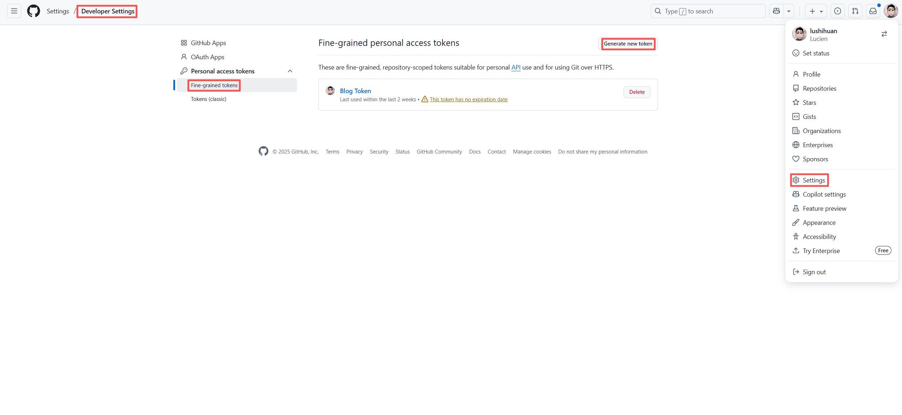
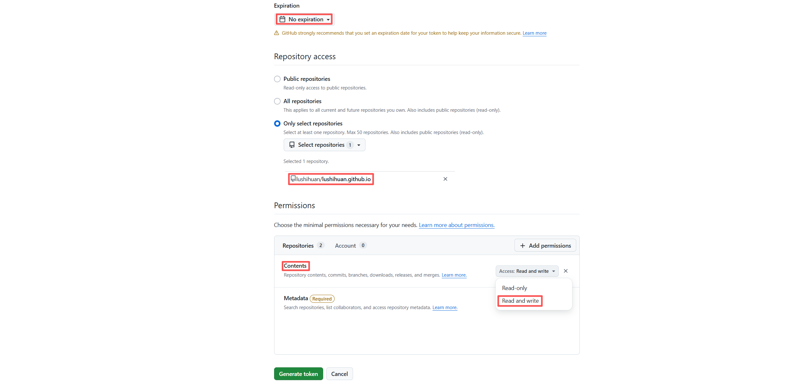

# 背景

故事发生在创建这个网站的过程中。因为我使用了Hexo和Github Pages来搭建我的博客，所以我的博客就是一个Git仓库。然后因为主题也是一个Git项目，那么就出现一个问题，我是把主题直接检出上传到我的仓库还是有什么其他的办法呢？

# Git Submodules

本来因为我比较少用Git，所以我是不知道有Git Submodules这个东西的。但是当我把检出的主题上传到仓库之后，神奇的事情发生了，我上传的主题文件夹自动变成了博客仓库的一个Module。又因为触发部署的就得的Workflow文件里配置了Submodules，所以刚好就能部署成功。

```yaml
jobs:
  build:
    runs-on: ubuntu-latest
    steps:
      - uses: actions/checkout@v4
        with:
          token: ${{ secrets.GITHUB_TOKEN }}
          # If your repository depends on submodule, please see: https://github.com/actions/checkout
          submodules: recursive
```

但是新的问题出现了，每次我主题仓库提交一次，我博客仓库就得多提交一次，因为需要提交主题仓库文件夹Md5的变化。虽然这个方案已经很好的解决了两个仓库的联动问题，毕竟多一次提交也刚好能触发我博客仓库部署的Workflow，但是我现在对这种重复的东西总是感到厌烦，那么就只能再找找有没有什么更好的办法了。

# 嵌套仓库

首先不使用Git Submodules，我得想办法把主题仓库再部署的时候检出才行。刚好我在看Actions使用文档的时候，发现检出插件是支持多种检出的配置的，其中就包括嵌套检出。那么事情就好办起来了，只需要按照文档配置好嵌套检出即可。

```yaml
jobs:
  build:
    runs-on: ubuntu-latest
    steps:
      - name: Checkout Blog
        uses: actions/checkout@v5
      - name: Checkout theme
        uses: actions/checkout@v5
        with:
          repository: lushihuan/hexo-theme-next
          path: themes/next
```

# 子仓库触发父仓库Action

解决了检出问题还有个问题需要解决，当我的主题仓库有提交时，得通知我的博客仓库进行重新部署，这样才能更新我最新的提交内容。在翻找了Github Actions和网上的文档后，发现触发Actions的方式里Repository Dispatch刚好可以实现这个效果。

## 创建Token

首先我们需要创建一个Token，让博客仓库的Actions有权限被第三方触发。下面是创建的过程，这里需要注意的是：

1. 创建的是Fine-grained tokens
2. 过期时间可以选不过期（当然如果你觉得不安全可以创建一个短期的定时更新）
3. 权限范围可以只选被触发的博客仓库
4. 权限要添加Content的Read and write权限





## 使用Repository Dispatch

创建完Token把Token添加到主题仓库的Secrets and variables - Actions - Secrets里，然后给他起一个名字。


然后在博客仓库的Actions Workflows文件里添加Repository Dispatch触发的配置，这里需要配置一个Type。

```yaml
on:
  push:
    branches:
      - master
  repository_dispatch:
    types: [ theme-push ]
```

配置完博客的Actions再配置主题仓库的Actions Workflows，这里注意需要把env里的变量替换自己的：

- ACCESS_TOKEN：上面创建的Secrets，格式`${{ secrets.Secrets名称 }}`
- EVENT：博客仓库设置的Type
- REPOSITORY：博客仓库的路径，格式为`用户名/仓库名`

```yaml
on:
  push:
    branches:
      - master

jobs:
  build:
    runs-on: ubuntu-latest
    steps:
      - uses: actions/checkout@v4
        with:
          fetch-depth: 1
      - name: Dispatch Event To Another Repository
        env:
          ACCESS_TOKEN: ${{ secrets.ACCESS_TOKEN }}
          EVENT: theme-push
          REPOSITORY: lushihuan/lushihuan.github.io
        run: |
          curl -L \
          -X POST \
          -H "Accept: application/vnd.github+json" \
          -H "Authorization: Bearer ${ACCESS_TOKEN}" \
          -H "X-GitHub-Api-Version: 2022-11-28" \
          https://api.github.com/repos/${REPOSITORY}/dispatches \
          -d '{"event_type":"${EVENT}"}'
```

之后就可以在主题仓库提交进行测试了。

## 更好的方法

后面我又发现了一个别人实现的Actions插件[peter-evans/repository-dispatch](https://github.com/peter-evans/repository-dispatch)，直接实现了我上面的效果而且更加简洁。其实上面的方法因为Token的原因一直失败，也是看了这个插件之后才知道Token要怎么创建才是正确的。

```yaml
on:
  push:
    branches:
      - master

jobs:
  Dispatch:
    runs-on: ubuntu-latest
    steps:
      - name: Repository Dispatch
        uses: peter-evans/repository-dispatch@v3
        with:
          token: ${{ secrets.ACCESS_TOKEN }}
          repository: lushihuan/lushihuan.github.io
          event-type: theme-push
```

# 结语

那么就成功的解决了博客和主题的部署问题，在两边提交都能触发部署，又可以独立的进行代码同步和提交，详细的代码可以直接查看我的Github博客和主题的仓库。