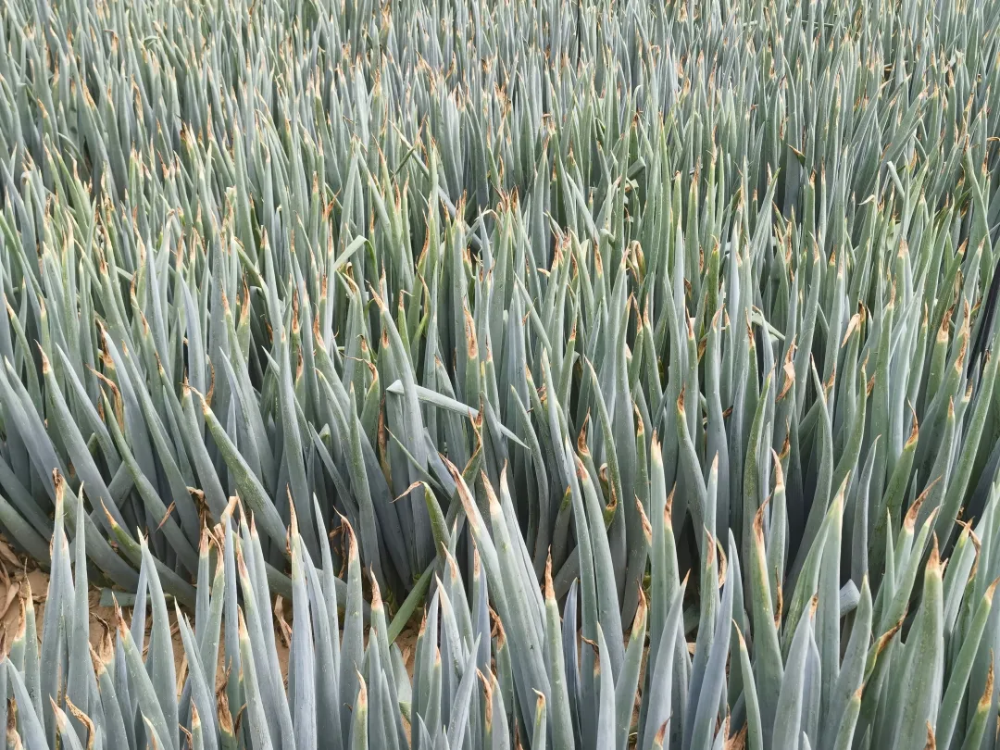
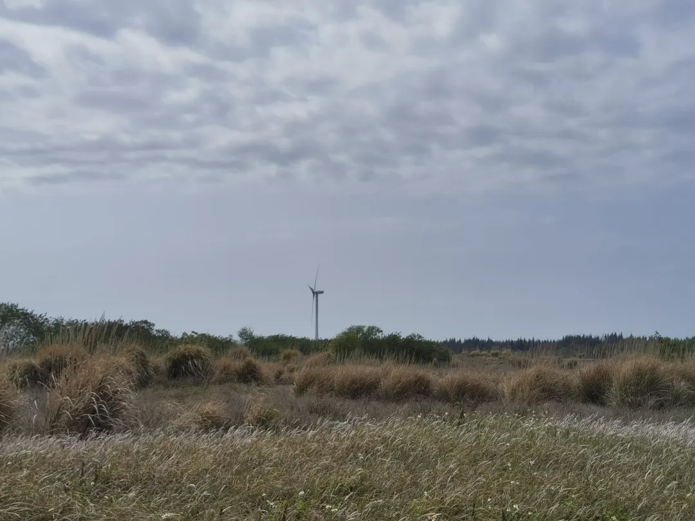

这篇文章大约写于十年前，一直保存在家里的一部小米平板上，特地叫我姐姐复制发给我，以下是稍微做了一点修改的原文。

世间万物终会逝去，记忆也会渐渐忘却，所以必须记录下来，要不然什么都忘了。

小时候清明节的最深刻的就是爷爷奶奶那间房子，那个房子基本只在清明节才会回去住。最早有印象是我大概五六岁的时候，那时的爷爷奶奶还很健康，他们会提前好几天回到湖东为清明节做各种准备。因为我还太小，所以他们不给我跟着去过纸，我就只能在家里陪着爷爷奶奶。他们在扫墓的时候我在干嘛已经忘了，但是有一个场景记忆很深刻，就是我醒来发现他们都去过纸了，然后我就边拉屎边哭。还有一个非常温暖的回忆片段，就是有一次我在门口趴在铁门上哭，有一群比我大的小孩路过，她们看见我在哭就拿了很多零食给我，现在想起来都还是觉得感谢她们。可惜时间太久远了，要是能找到她们我一定好好跟她们交个朋友！后来我长大到差不多八九岁，我就能跟着去过纸了。那时的爷爷奶奶也还算健康，我们过纸到中途时他们会搭车过来跟我们一起，其实最主要的应该是过来看看我的伯伯的墓。

年年的扫墓我都回去，只是感觉越来越没那么期待，不过我始终还是期待的，只因那是我的家乡，那是湖东！

还有一些有意思的记忆顺便写出来，一个就是这间房子的装扮，可能是小时候没见过世面，我一直觉得那是很豪华的房子，感觉上也很温馨，气味上似乎也很特殊。正是由于这份感情，后面他被租给别人时我都非常的不愿（最后被卖掉了）。第二个就是一道在这个房子里吃的一道菜的回忆，就是腊肠炒蛋。第三个就是这间房子有个房间是我们专用的，在那个房间睡的记忆也很深刻。很安静，墙上有个电箱闪着光，外面不时会传来有人经过的声音，一大早奶奶在准备东西的声音，现在回想起来还是很温馨的感觉。第四个就是房子里的一些物件，有一辆很精致小车模型，还有一尊关公像，一些吹气玩具，还有一个鸟用嘴夹牙签的牙签盒，如今有些东西都不见了。第五个就是爷爷奶奶看的电视，戏剧和西游记。第六个就是我以前经常带些东西放在我住的房间里，比如不知道从哪拿的一个玩具车和吃方便面送的硬塑料板拼的车，然而这些东西我也找不到了，多想找回这些童年回忆啊……

