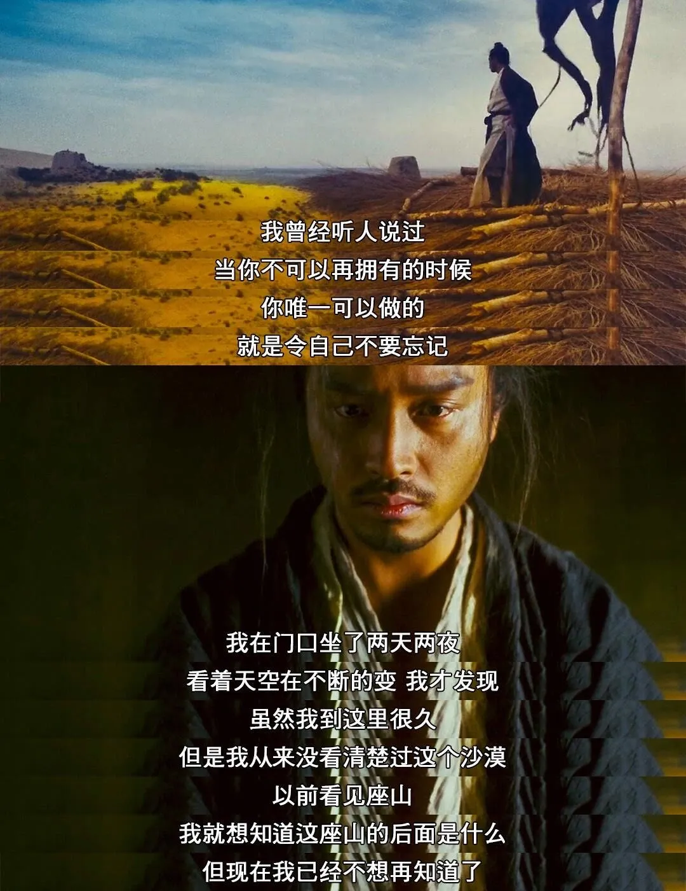

# 那天下午听到的一首歌

有些想法可能在脑海里已经思考过很多次，但是只要你不把他记录下来，那么在某个情境下你又会一遍又一遍萌生出同样的思考。某天下午，一首网易云的摇滚推荐，又把我带入了我万千思绪的其中一缕之中。那是一个不是很有名的乐队叫“烂漫无期乐队”，歌名叫做《我们应该在最高潮的时候死去》。其实为什么我会去听这首歌，就是因为这个歌名。在看到他的一瞬间，我就迅速思考了一遍。对啊，要是在最高潮的时候死去，那是多美好的事啊。

# 只要有0.01%那就是有

自某件事之后，我的情感好像变得越来越麻木了。有人跟我说过“时间会磨平一切”，也确实时间越长忘记的细节越多。也许是我信以为真了，我开始让自己变得麻木。如果你问我，你现在还在意吗？你还怨恨吗？我肯定可以胸有成竹的跟你说“我一点都不”。在99.9%的时间里，我都是真心的祝福每个人希望他们好。可是，某天深夜里情绪翻涌的时候，我还是能记起当时的感受。在这0.01%的时间里，我发现还是做不到一点怨恨都没有，然后就被情绪漩涡所淹没。就像我最喜欢的动漫《犬夜叉》里的白心上人，做了一辈子的圣人，在死前发现自己居然会有一丝的恐惧和后悔，然后就在黑暗之中出不来了。也许，麻木只是一种保护，只是我的麻木好像也伤害了其他人，他们又何尝不是另一个我呢......

# 我好像对不好的回忆更深刻

不知道是我基因写死还是后期养成，我对不好的回忆总是能身临其境。以至于每次我想起我的成长经历，我想到的都是各种悲伤、痛苦的瞬间。每次我这样想的时候，就会有人跟我说“你不要太夸张了，不要卖惨”，可是我真的是不由自主的会这样想。比如，我总能想起我妈不给我买零食、玩具的场景，我总能想起我爸贬低我的场景，我总能想起期待落空的场景。结果，随着时间的流逝，我回忆里不好的瞬间越来越多。

# 害怕回忆

每次跟我爸妈一起出去玩，我妈喜欢拍照，我总是下意识不想一起拍。在很早的时候我就想过，如果我爸妈不在了会是什么样的场景？我设身处地想了下，我会非常的伤心难过。可能从我有这个想法开始，我就开始下意识不想和我爸妈拍照了，我害怕日后去处理这些照片，我害怕看到这些照片会让我的回忆翻涌。原来，我的保护机制很早就开始有了......

# 人最大的烦恼，就是记性太好

我一直很羡慕那些获得没心没肺的人，好多事情好像他们可以很快就忘掉。这几年因为工作太累了，我感觉我的记忆已经没以前那么好了，但是对比别人好像还是好得出奇。甚至在工作中，我好像也总能记住更多的事。项目的大部分细节我看过都能记得大概，而有些人明明自己经手过却转头就忘了。可能是我自己如此，所以看到别人记忆力很差，我反而很受不了，所以某年的年度差评我就给了那位同事，理由就是“记忆力太差”。扯远了，其实这句话出自王家卫的《东邪西毒》。里面的欧阳锋因为放不下和自己大嫂的爱恨情仇，再也没有回过自己的家乡。黄药师带着他大嫂送的一坛酒，跟欧阳锋说：“不久前，我遇上一个人，送给我一坛酒，她说那叫‘醉生梦死’，喝了之后，可以叫你忘掉以前做过的任何事。我很奇怪，为什么会有这样的酒。她说人最大的烦恼，就是记性太好，如果什么都可以忘掉，以后的每一天将会是一个新的开始，那你说这有多开心。”而欧阳锋在结局得知这坛酒的来历和大嫂已经过世了后，说到：“其实‘醉生梦死’只不过是她跟我开的一一个玩笑，你越想知道自己是不是忘记的时候，你反而记得更清楚。我曾经听人说过，当你不能够再拥有，你唯一可以做的，就是令自己不要忘记。”然后欧阳锋就回到了家乡，重新开始。其实某些方面我跟欧阳锋很像，前面说的那么多究其原因其实都是我记性太好，而怎么解决好像也也说的很明白了......

