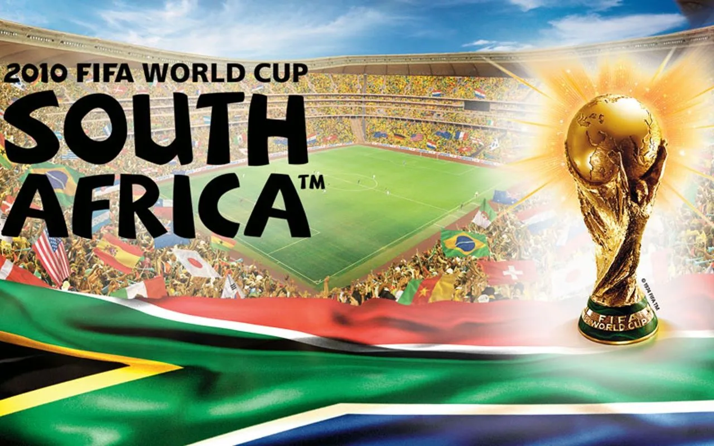
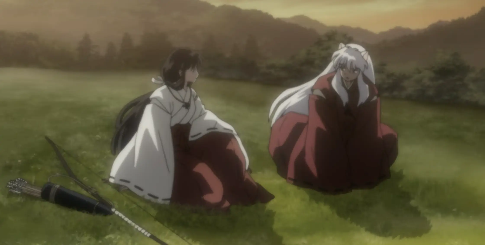
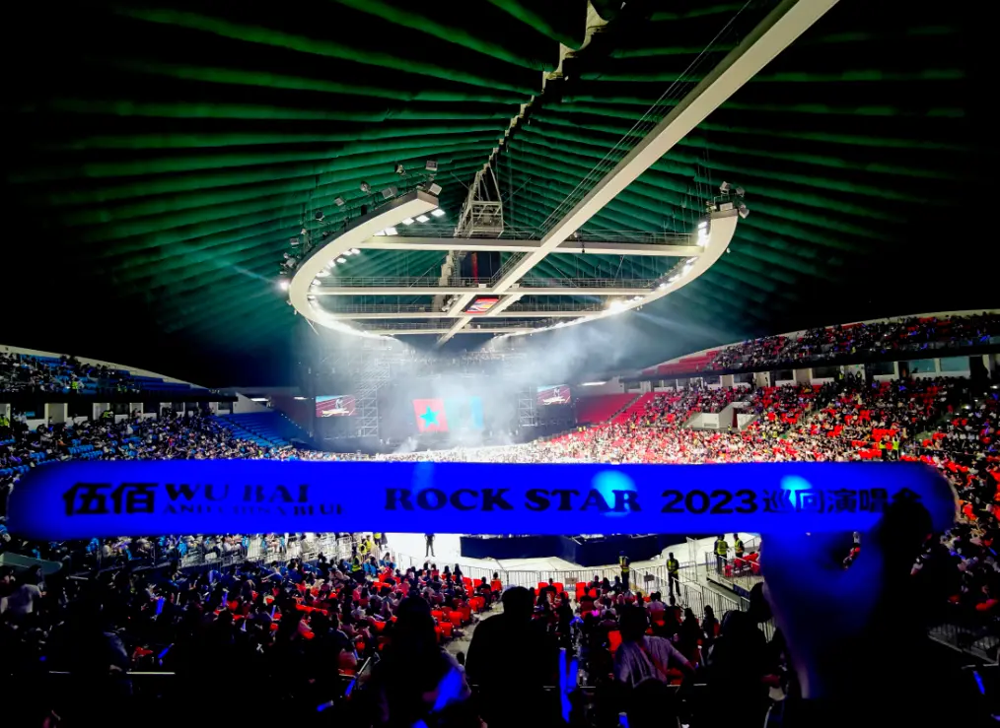
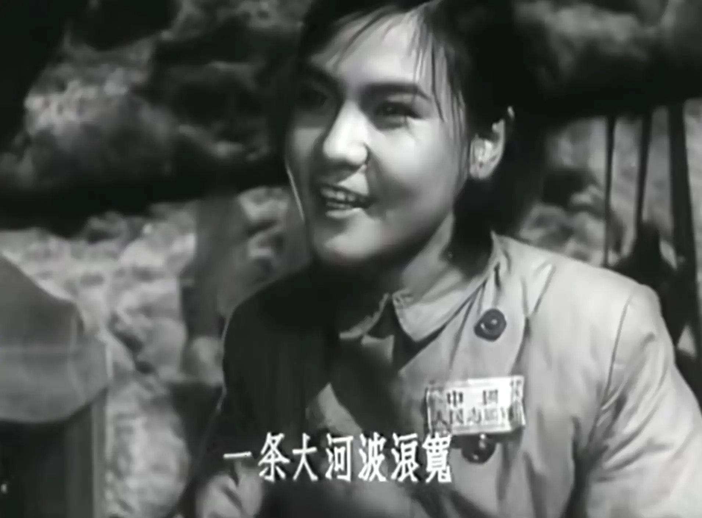

音乐是一种很神奇的东西，每当听到一些以前听过的音乐，思绪就能被带回那个时期，而且比单纯的记忆更加身临其境。

一个最好的例子就是世界杯相关歌曲。我小时候不怎么主动的去听音乐，所以音乐一般都是被动听到的。印象最深刻的世界杯歌曲也是在这个时期听到的，它们就是《Waving Flag》和《WAKA WAKA》。那是2010年的南非世界杯，不知道为什么这一届世界杯宣传力度特别大。我还记得那时是QQ农场火爆的时期，几乎所有QQ空间小游戏都有对应的世界杯活动，电视台也全都是世界杯的内容，可能是中国资本深度参与了这一届世界杯吧。甚至《Waving Flag》还有对应的中文版《旗开得胜》，还是张靓颖和张学友唱的。还有一件事印象深刻，就是那年的世界杯比赛满场都是呜呜声，那是大部分由中国生产的呜呜祖拉发出来的声音。记忆中的2010年是充满活力的，中国成功举办北京奥运不久，经济飞速发展，互联网步入移动互联网时代。现在只要听到《Waving Flag》和《WAKA WAKA》就能马上回想起这一切。同样有记忆的还有巴西世界杯和卡塔尔世界杯的歌曲。巴西世界杯时我初中毕业，已经记不清当时在干什么了，不过听到《We Are One》还是有种回到当年的感觉。我没记错的话，这时互联网蓬勃发展，这一届世界杯甚至可以直接在网上下注赌球。卡塔尔世界杯时我已经工作了，当时和我的初恋在一起，那时候感情已经快破裂了，听到这届世界杯的歌曲就会想起当时住的复式公寓的画面。这届世界杯的歌曲《Hayya Hayya》和《TukohTaka》初听觉得是什么玩意，不过后面真的是越听越上头。看到这里可能有人发现了，我好像略过了一届世界杯，他就是俄罗斯世界杯，只能说对这一届世界杯的歌曲是真的一点印象都没有。我当时在上大学，可能是在认真学习，所以没怎么看这一届世界杯。只记得那年的黑马冰岛队带火了维京战吼，到现在都还流行在足球场上。

一些特殊时期听到的歌曲也总是令人印象深刻。这就不得不提到我最爱的动漫之一《犬夜叉》了。内容上犬夜叉是非常优秀的，以至于值得单独为他开一篇细说。从音乐上看犬夜叉也同样的优秀，每个OP和ED都非常好听，全都是当时比较红的歌手唱的。每次听到《Change The World》，就能想起小时候看星空卫视的场景。还有去盗版碟小店买DVD，然后回家看DVD的场景。大概在我初中时，我看完了犬夜叉完结篇。看到神乐死和桔梗死的时候我都哭了，导致现在听到完结篇的《With You》、《Diamond》都有点泪目。我小时候很少看什么看哭，但是犬夜叉是最早做到让我哭的内容之一。看到犬夜叉和桔梗原本那么美好最后却那么遗憾，还有犬夜叉小时候被人排挤的画面时，总是能触动到我。说到让我哭的内容，不得不提一下张艺谋的《山楂树之恋》。同样是原本那么美好最后结局却那么遗憾，加上常石磊唱的《山楂树》，令人潸然泪下。我发现我对遗憾的内容泪点好像比较低，我看《未闻花名》也是哭得很惨。同样特殊的还有高中时期听的歌，我前面说过我小时候很少主动听歌，我开始主动听歌应该是高中才开始的，可能是那时候开始有了自己的手机。这个时期让我印象深刻的就是许巍的歌，可能是高中开始会对未来感到焦虑了吧，所以当听到《蓝莲花》、《曾经的你》时，对里面表达的自由、随性非常向往。

还有陪伴我情感经历的歌曲。某种意义上来说这也算是一种特殊时期，这些时期听过的歌也总是令人印象深刻。高中时暗恋班上一位女同学，在一次KTV聚会时听她唱了《谁明浪子心》。在聚会结束后，喝完酒的我情绪大爆发在微信跟她说了很多话。说的什么已经忘了，但是还是能回忆起那份青春的悸动。大学学车时认识了一个江门的女孩，那时觉得她也没有非常漂亮，但是我又好像喜欢上了她。然后那段时间就一直在听郑钧的《灰姑娘》，觉得还挺符合我的心境的，结果现在我一听这歌就会想起她。不过那年学完车放寒假就遇到了疫情，接下来就是半年的居家，这段感情也就不了了之。后来在实习时遇到了我的初恋，当时因为要准备年会节目有了很多交流，久而久之的就喜欢上了她。之后在追她的过程中遇到了挫折，导致那段时间很EMO。浑浑噩噩之中一直在听五条人的《柔河里》，同样也是觉得挺符合我当时的心境。不过最终我没有浑浑噩噩多久，因为她突然间回心转意了。再后来我们分手了，那段时间可以说是我人生低谷之一。刚好那时我又第一次感染新冠，精神和身体都处在一种崩溃的边缘。在这个时候又是郑钧给我带来了光，一首《天下没有不散的宴席》让我释怀了。我一直循环的听着这首歌，它和时间让我慢慢的归于平静。后面我一个人去听了一次伍佰Rock Star 1演唱会，让我感觉彻底活了过来。我在最后时刻决定加价买票，至今我仍认为是我一生做的最正确的决定之一。除了以上这些，还有徐佳莹的《给》、五十度灰主题曲《Love Me Like You Do》等，伴随着我的每次情感波动。

还有些歌曲总是给我带来莫名的情感。不知道为什么，每次听到《我的祖国》这首歌时总会很感动，以至于好几次我在深夜独自一人听到这首歌之后眼含热泪。我记得爱情公寓有一幕是一菲在唱这首歌，我当时看到也是潸然泪下。这首歌还有个名场面，有个台独作家叫龙应台，有一次她在香港开了一个《一首歌，一个时代》的讲座，她提问台下观众“你们的启蒙歌是哪一首呢？”，结果台下观众说是《我的祖国》，她不相信反问到“《我的祖国》怎么唱？”，结果台下观众大合唱啪啪打脸。我想为什么我会对这首歌有这么大情感，可能是因为我本身有很深的乡土和爱国情怀，而这首歌前半段就是在描述志愿军战士思乡的场景。同样的还有《东方红》这首歌，这里我要推荐唐朝乐队《太阳》这首歌，有时他们演绎这首歌的时候会加入摇滚版的《东方红》。至于为什么我对《东方红》也有这种情感？一是对他的尊敬，对他一些行为的困惑，对他逝去的感慨，二是对我自己的迷茫。

文字、语言是一种表达的工具，我觉得音乐也是，甚至有时候我觉得音乐能表达的东西是文字、语言所表达不了的。看到这里，可以打开音乐软件。让我们继续听下去吧，让音乐继续标记正在经历的此刻。未来某天，他会带你回到此刻，成为不可磨灭的记忆。
